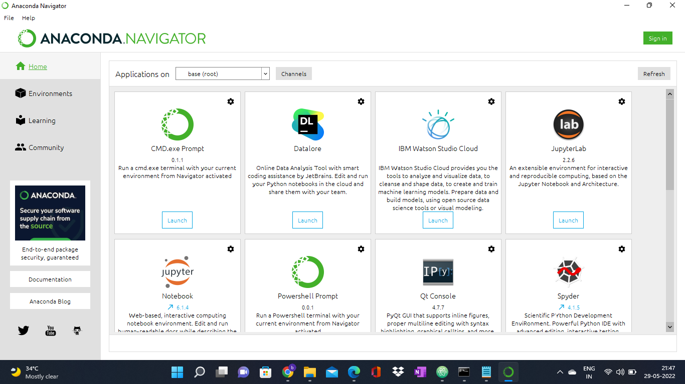
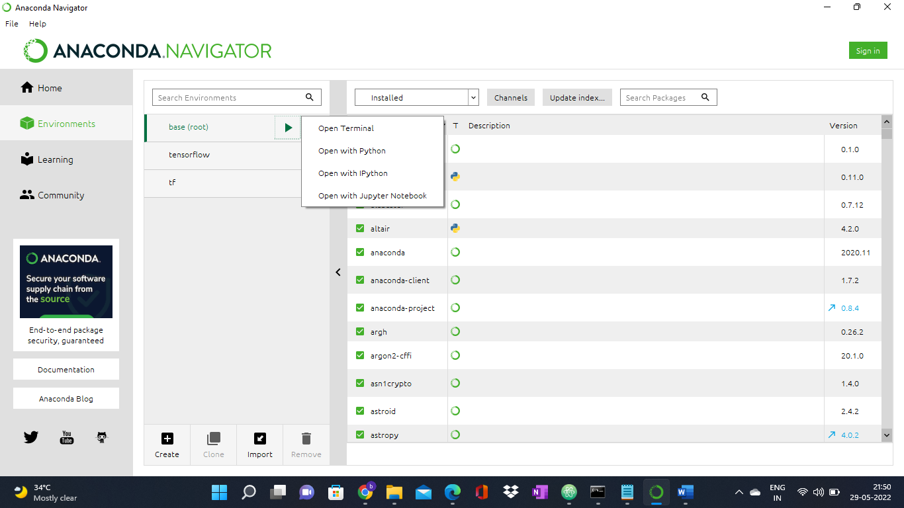
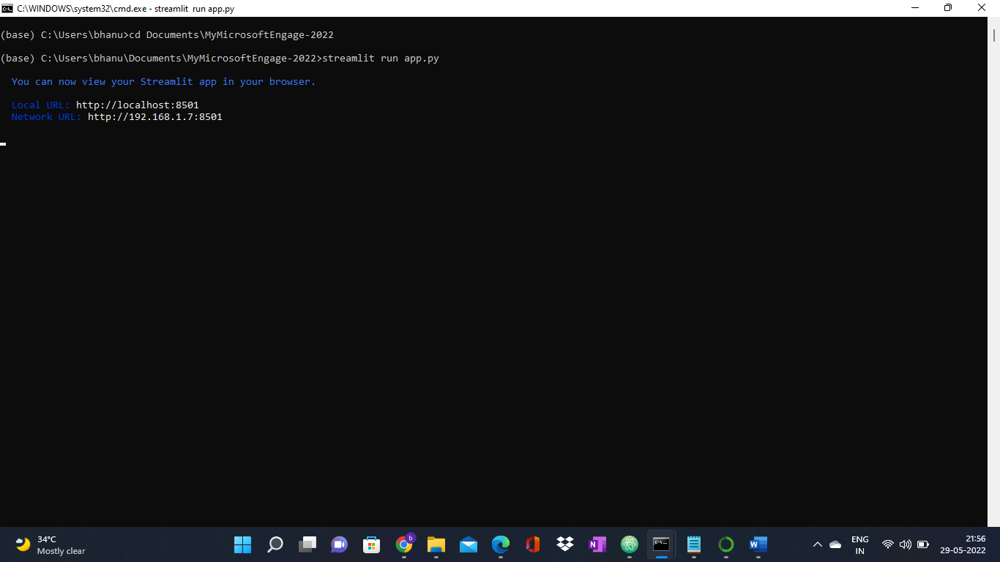
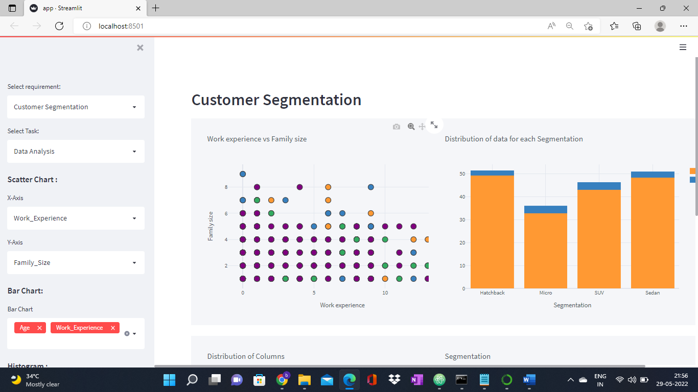
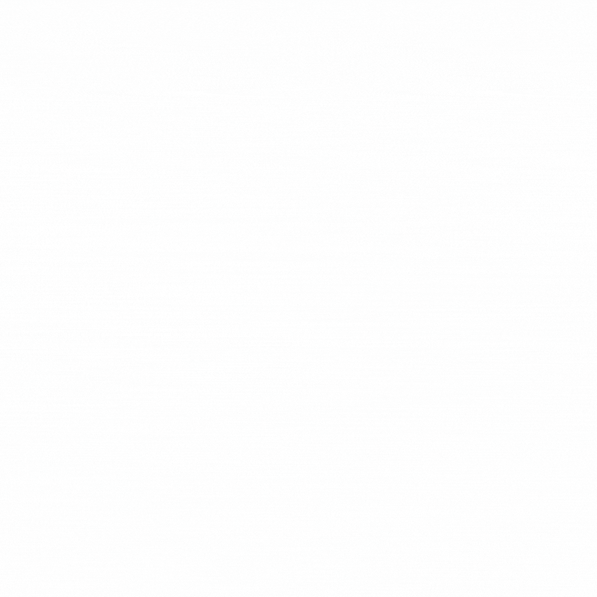

# Microsoft-Engage-2022

## Customer Segmentation
Customer segmentation is the practice of dividing a customer base into groups of individuals that are similar in specific ways relevant to marketing, such as age, gender, interests and spending habits.

## Price Prediction
The price of a car depends on a lot of factors like the goodwill of the brand of the car, features of the car, horsepower and the mileage it gives and many more. Car price prediction is one of the major research areas in machine learning.

## Here is how my web application works!

-"Customer Segmentation" analyzes and predicts the segment to which the customer belongs to based on the inputs given. like:
  Gender, Work Experience , Family size etc.
  
  
 -"Price prediction" suggests the suitable price to the manufactured car by the given inputs like:
  Fuel Type, Number of Doors, Engine Location, Horsepower
   
  ## It is also deployed on Streamlit for a while at [Link](https://share.streamlit.io/bhanu425-code/mymicrosoftengage-2022/main/app.py)
  
  ## STEPS TO RUN MY APP IN LOCAL:

•	Clone the repository  ---  https://github.com/Bhanu425-code/MyMicrosoftEngage-2022.git
•	Open Anaconda Navigator

 

•	Environments -> root  -> Open terminal

  

•	Navigate to the path where you have cloned my Repository

•	Make sure you have streamlit installed by executing below command
streamlit --version

•	To download the library, pip install streamlit 

•	After successful installation, Run the below command 
streamlit run app.py
  

•	WELCOME TO MY APP……….!!!!

  
## Customer Segmentation

## Price Prediction

